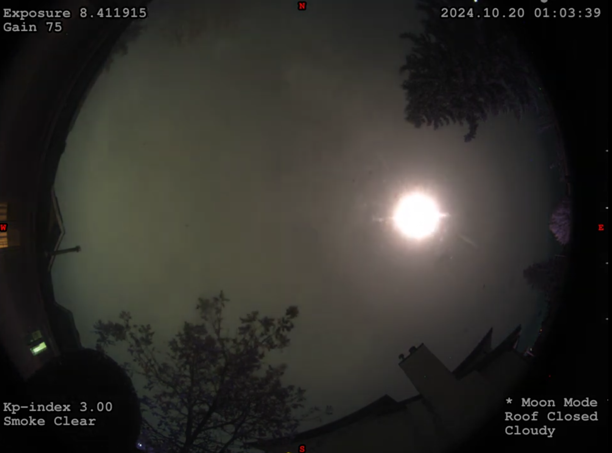

# mlCloudDetect

Cloud Detection using AllSky Cameras. This software will examine images from any allsky camera that can produce an image on disk at a known location. For indi-allsky, the software will load the latest image location from the database. Using Machine Learning, the software compares the most recent image with it's training model to produce a file that will tell you whether the sky is cloudy or clear. For observatories that means open the roof or not. 

The software also supports pending states where it will delay opening or closing so the observatory isn't constantly opening and closing all night! All messages and configuration is set using an INI file. 

Requires Python == 3.10 if not using Windows executables.

Releases:
* Version 1.0.1 returns to using a Keras V2 model and thus requires Python 3.10
* Version 1.0.0+ requires a Keras V3 model and will run in any version of Python. It takes no parameters but uses a config file mlCloudDetect.ini (see below). 
* Version 0.9.0 requires Python 3.8 and Keras/Tensorflow 2.11 to support V2 keras model files like those created by Teachable Machine. It requires command line parameters. Run the program without parameters to see usage or see below.

See the Wiki for complete documentation.

